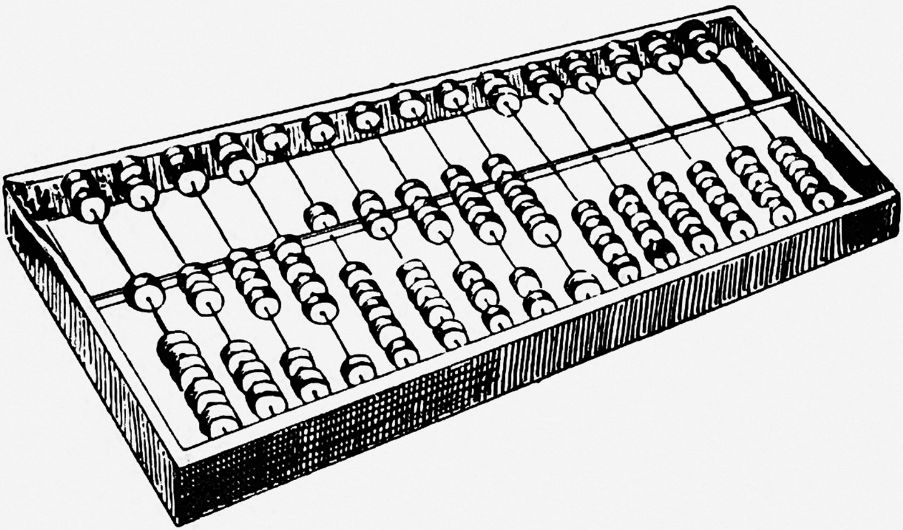
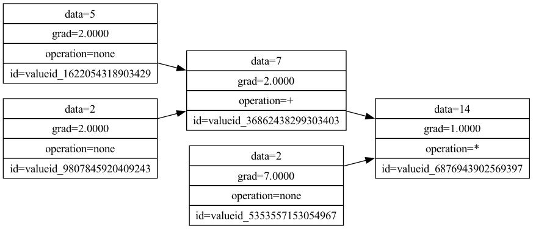

# Backprop



Backprop is an [automatic differentiation](https://en.wikipedia.org/wiki/Automatic_differentiation) implementation writen in Rust. 

It supports computing the gradients of nodes in a computation graph for basic math operations: `addition`, `subtraction`, `multiplication` and `division`.

## Example usage 

```rust
use backprop::{value};

fn main(){
    let x = &Value::new(5.0);
    let w = &Value::new(2.0);

    let y = x + w;

    let z = y * Value::new(2.0);

    // Get the value
    println!("{}", z.get_data());

    // Computes gradients for the computation graph
    z.run_grad();

    // Get the computed gradient
    println!("{}", x.get_gradient());
}
```

The above computation generates the below graph:



### Visualisation

The implementation supports generating an output file of the computation graph through the use of GraphViz `dot` files.

```rust
use backprop::{value};

fn main(){
    let x = &Value::new(5.0);
    let w = &Value::new(2.0);

    let y = x + w;
    
    // Computes gradients for the computation graph
    y.run_grad();

    // Outputs a dot file in the crate directory
    write_graphiz_dot_file(&y, "graph.dot");
}
```

The outputted `dot` file can then be rendered into a `png` file by running the Graphviz CLI tool:

```
dot -Tpng graph.dot -o graph.png
```

Alternatively, the generated `dot` file can be viewed in an onlinr GraphViz file render.

## Running tests

```shell
cargo test
```

## Todo

* Replace dynamically allocated `Vec<f64>` with `[f64]` arrays.
* Add Benchmarks
* Add MLP tests

## Acknowledgments

1. This library was inspired by [Kaparthy's micrograd Python library](https://github.com/karpathy/micrograd).
2. The [Rust documentation on Smart pointers](https://doc.rust-lang.org/book/ch15-00-smart-pointers.html) was really helpful in modelling the nodes within the graph.